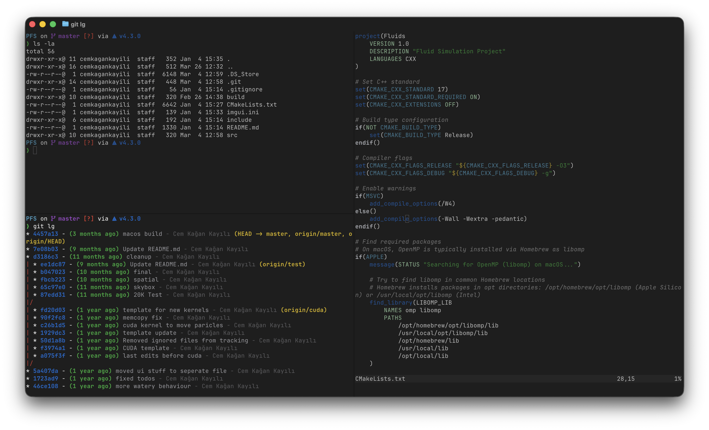

# apple.nvim

A Neovim colorscheme inspired by Apple system UI colors (Ghostty / iTerm2).

## What it themes

`apple.nvim` sets a small, focused set of highlight groups for:

- Core editor UI (e.g. `Normal`, `CursorLine`, `StatusLine`, line numbers)
- Basic syntax groups (comments, keywords, strings, functions, types, errors/warnings)
- Treesitter capture groups (`@comment`, `@keyword`, `@string`, `@function`, `@type`, `@variable`)
- LSP diagnostics (`DiagnosticError`, `DiagnosticWarn`, `DiagnosticInfo`, `DiagnosticHint`)
- Telescope (`TelescopeNormal`, `TelescopeBorder`)
- nvim-cmp (`CmpItemAbbr`, `CmpItemKind`)
- gitsigns (`GitSignsAdd`, `GitSignsChange`, `GitSignsDelete`)

## Light/Dark mode

On macOS, the theme auto-detects whether your system is in dark mode via:

`defaults read -g AppleInterfaceStyle`

If that command is unavailable (e.g. non-macOS), the theme falls back to the dark palette.

## Install (lazy.nvim)

```lua
{
  "cemkagank/apple.nvim",
  priority = 1000,
  config = function()
    vim.cmd("colorscheme apple")
  end,
}
```

After installing, run:

`:colorscheme apple`

## Screenshots

```md


```